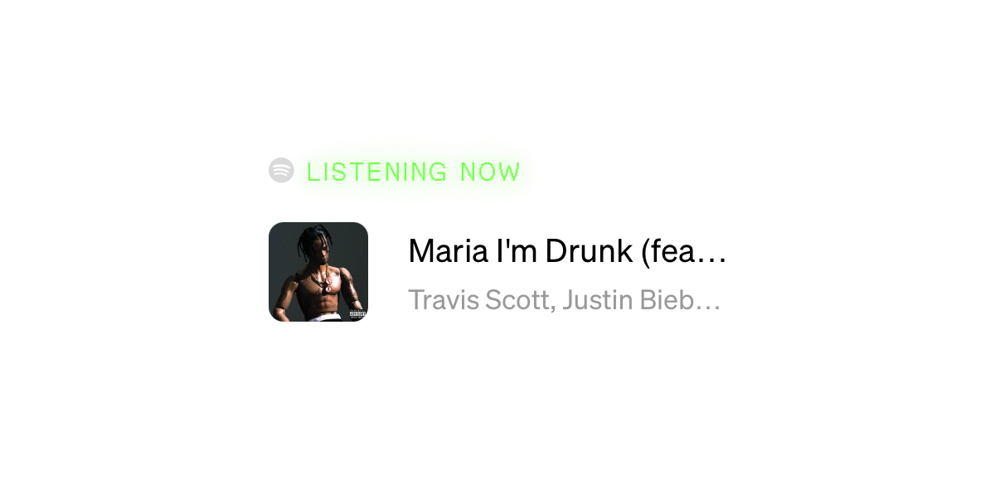

# use-earworm



A minimal Spotify now-playing widget for React. Shows what you're currently listening to or your last played track.

## Install

```bash
npm i use-earworm
```

## Quick Start

### 1. Set up your Spotify app

1. Go to [Spotify Developer Dashboard](https://developer.spotify.com/dashboard) and create an app
2. Set the redirect URI to `http://localhost:3000/callback`
3. Note your **Client ID** and **Client Secret**
4. Get a refresh token by following [Spotify's authorization guide](https://developer.spotify.com/documentation/web-api/tutorials/code-flow)

### 2. Add environment variables

```env
SPOTIFY_CLIENT_ID=your_client_id
SPOTIFY_CLIENT_SECRET=your_client_secret
SPOTIFY_REFRESH_TOKEN=your_refresh_token
```

### 3. Create an API route

The widget fetches data from an API route you create. use-earworm exports a `getNowPlaying` helper to make this easy.

**Next.js** (App Router)

```ts
// app/api/spotify/now-playing/route.ts
import { getNowPlaying } from "use-earworm/api";

export async function GET() {
  try {
    const track = await getNowPlaying({
      clientId: process.env.SPOTIFY_CLIENT_ID!,
      clientSecret: process.env.SPOTIFY_CLIENT_SECRET!,
      refreshToken: process.env.SPOTIFY_REFRESH_TOKEN!,
    });

    return Response.json(track ?? { isPlaying: false }, {
      headers: { "Cache-Control": "public, s-maxage=30, stale-while-revalidate=15" },
    });
  } catch {
    return Response.json({ isPlaying: false });
  }
}
```

**Astro**

```ts
// src/pages/api/spotify/now-playing.ts
import type { APIRoute } from "astro";
import { getNowPlaying } from "use-earworm/api";

export const prerender = false;

export const GET: APIRoute = async () => {
  try {
    const track = await getNowPlaying({
      clientId: import.meta.env.SPOTIFY_CLIENT_ID,
      clientSecret: import.meta.env.SPOTIFY_CLIENT_SECRET,
      refreshToken: import.meta.env.SPOTIFY_REFRESH_TOKEN,
    });

    return new Response(JSON.stringify(track ?? { isPlaying: false }), {
      headers: {
        "Content-Type": "application/json",
        "Cache-Control": "public, s-maxage=30, stale-while-revalidate=15",
      },
    });
  } catch {
    return new Response(JSON.stringify({ isPlaying: false }), {
      headers: { "Content-Type": "application/json" },
    });
  }
};
```

### 4. Add the component

```tsx
import { Earworm } from "use-earworm";

export default function Page() {
  return <Earworm />;
}
```

## Props

| Prop | Type | Default | Description |
|------|------|---------|-------------|
| `endpoint` | `string` | `"/api/spotify/now-playing"` | API endpoint URL |
| `pollInterval` | `number` | `10000` | Polling interval in ms |
| `activeColor` | `string` | `"#75FF4F"` | Color for "LISTENING NOW" |
| `inactiveColor` | `string` | `"#E2E2E2"` | Color for "LAST LISTEN" |
| `fontFamily` | `string` | `"inherit"` | Font family |

## How it works

- Polls your API route every 10 seconds (configurable)
- Shows "LISTENING NOW" with a glow effect when actively playing
- Falls back to "LAST LISTEN" with your most recent track
- Links to the track on Spotify
- Shows album art, track name, and artist
- Zero styling dependencies (no Tailwind required)
- Renders nothing if Spotify is unreachable

## License

MIT
